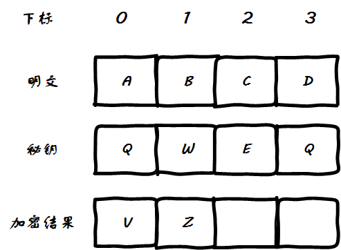

#  Porta加密(Porta Cipher)

# 一、安装

```bash
go get -u github.com/cryptography-research-lab/go-porta-cipher
```

# 二、使用示例

## 2.1 加密 & 解密示例代码

```go
package main

import (
	"fmt"
	porta_cipher "github.com/cryptography-research-lab/go-porta-cipher"
)

func main() {

	key := "THISISVERYSECURITYKEY"
	encrypt, err := porta_cipher.Encrypt("HELLOWORLD", key)
	if err != nil {·		fmt.Println("加密时发生了错误： " + err.Error())
		return
	}
	fmt.Println("加密结果： " + encrypt) // Output: 加密结果： QUPUKAECTP

	decrypt, err := porta_cipher.Decrypt(encrypt, key)
	if err != nil {
		fmt.Println("解密时发生了错误： " + err.Error())
		return
	}
	fmt.Println("解密结果： " + decrypt) // Output: 解密结果： HELLOWORLD

}
```

## 2.2 破解代码示例

TODO 

# 三、Porta加密详解

## 3.1 加密

Porta类似于[维吉尼亚密码](https://github.com/cryptography-research-lab/go-Vigenere)，它有一个固定的密码表：

```text
KEYS| A B C D E F G H I J K L M N O P Q R S T U V W X Y Z
----|----------------------------------------------------
A,B | N O P Q R S T U V W X Y Z A B C D E F G H I J K L M
C,D | O P Q R S T U V W X Y Z N M A B C D E F G H I J K L
E,F | P Q R S T U V W X Y Z N O L M A B C D E F G H I J K
G,H | Q R S T U V W X Y Z N O P K L M A B C D E F G H I J
I,J | R S T U V W X Y Z N O P Q J K L M A B C D E F G H I
K,L | S T U V W X Y Z N O P Q R I J K L M A B C D E F G H
M,N | T U V W X Y Z N O P Q R S H I J K L M A B C D E F G
O,P | U V W X Y Z N O P Q R S T G H I J K L M A B C D E F
Q,R | V W X Y Z N O P Q R S T U F G H I J K L M A B C D E
S,T | W X Y Z N O P Q R S T U V E F G H I J K L M A B C D
U,V | X Y Z N O P Q R S T U V W D E F G H I J K L M A B C
W,X | Y Z N O P Q R S T U V W X C D E F G H I J K L M A B
Y,Z | Z N O P Q R S T U V W X Y B C D E F G H I J K L M A
```

要求输入的要加密内容和秘钥都是英文字母，`x`坐标为明文字母对应的列，每一个明文字母对应一列，总共有26列，`y`坐标为秘钥字母对应的行，其中会出现两个字母对应一行的情况，所以总共有13行，因为处理的时候明文字母和秘钥字母是一一对应处理的，所以加密的时候需要先将秘钥重复自身直到字符长度和明文对齐，然后明文和秘钥相同下标对应的字母所对应的行和列的交点就是要映射到的字母，直接说有点绕不太好想明白，下面是一个实际的例子来说明加密的详细过程。

比如明文为`ABCD`，秘钥为`QWE`，则加密过程如下，最开始明文是这样子的：


秘钥是这样子的：


明文和秘钥的长度是不相等的：


首先将密文`QWE`自身重复拼接直到与明文字符长度一样，这一步完成之后秘钥变为`QWEQ`，此时明文和秘钥的长度都是4：


加密结果的长度和明文是相同的，现在的情况是这样，接下来要开始加密了： 


然后看下标0，明文下标0的字母是A，秘钥的下标0的字母是Q，看加密表中A对应的列和Q对应的行的交点处的字母是V，所以加密结果的第一个字符就是V：


然后看下标1，明文下标1的字母是B，秘钥下标1的字母W，交点处字母为Z：



然后看下标2，明文下标2字母为C，秘钥下标2处为E，交点处字母为R：


然后看下标3，明文下标3字母为D，秘钥下标3为Q，交点处字母为Y：


此时得到了加密结果`VZRY`：


## 3.2 解密

Porta加密的解密过程和加密过程是一样的，我们以加密后的密文`VZRY`和秘钥`QWE`进行一次解密，因为前面已经说过加密的过程了，所以这里从另一个角度来看解密的过程。

首先密文V是通过`A --> Q  --> V`得到的，解密的话是`V --> Q --> A `，让我们观察表中这两个映射关系，似乎有某些关系： 


然后是`B --> W -- > Z`，解密`Z --> W --> B`： 


然后是`C --> E --> R `，解密`R --> E --> C`： 


然后是`D --> Q --> Y `，解密`Y --> Q --> D`：


通过观察上面的解密过程，我们得出下面几个规律：

1. 秘钥只是用来决定使用13行中的哪一行的，除此之外就没有其他作用了
2. 将明文称为x，将密文称为x'，则只需要每一行满足下标x的值为x'，而x'的值为x即可，因此可以随机生成13对来填充

接下来将验证这个想法，我把它称之为对Porta的加密表的扩展，相当于可以不使用默认的加密表。

# 四、Porta破解详解

TODO 

# 五、TODO

- 验证加密表是否可以是自定义的，会有什么影响 


